# Tutorial: Güngören Landslide Analysis - Complete Workflow

## Introduction

This comprehensive tutorial demonstrates the complete InSARLite workflow using real research data from the Güngören landslide in northeastern Turkey. This case study showcases InSARLite's capabilities for detecting precursory deformation signals before catastrophic slope failures.

### Study Area Background

On December 8, 2024, a catastrophic landslide occurred in the Güngören area of northeastern Turkey, causing significant damage and loss of life. This tutorial demonstrates how InSAR time series analysis can detect precursory deformation signals in the months leading up to such failures, highlighting the potential for InSAR-based early warning systems.

The analysis reveals that the landslide was preceded by measurable surface deformation, with mean line-of-sight (LOS) velocities reaching up to 25 mm/yr in the source area. Notably, an acceleration in deformation was observed in November 2024, approximately one month before the failure event.

### Tutorial Objectives

By completing this tutorial, you will:

- Master the complete InSARLite workflow from installation to final results
- Process 60 Sentinel-1 acquisitions covering a real landslide event
- Extract high-quality deformation time series showing precursory signals
- Generate publication-quality results suitable for scientific research
- Understand best practices for InSAR time series analysis

### Dataset Information

**Location**: Güngören, northeastern Turkey  
**Event Date**: December 8, 2024 (landslide failure)  
**Satellite**: Sentinel-1  
**Total Acquisitions**: 60 scenes  
**Master Image**: August 29, 2023  
**Orbit**: Ascending  
**Subswath**: IW2 (F2 only)  
**Temporal Coverage**: ~18 months (pre-failure period with 2 post-event acquisitions)  

### Prerequisites

Before starting this tutorial, ensure you have:

- **InSARLite v1.3.0** installed ([Installation Guide](../installation.md))
- **GMTSAR** properly configured
- **NASA Earthdata credentials** ([Register here](https://urs.earthdata.nasa.gov/))
- **System Requirements**:
  - ~710 GB free storage space (328.8 GB downloads + ~320 GB processing in F2 folder + ~60 GB outputs)
  - 16 GB RAM minimum, 32 GB recommended
  - Ubuntu 20.04 or 22.04 LTS
  - Multi-core processor strongly recommended (parallel processing capability)

### Time and Storage Requirements

**Processing Time**: ~50+ hours total (highly dependent on CPU cores and internet speed)

- Project setup and data download: 1-3 hours
- Baseline network design: 10-15 minutes  
- Interferogram generation: 30-40 hours (parallel processing recommended)
- Phase unwrapping: 8-12 hours
- SBAS inversion: 2-4 hours
- Visualization and analysis: Interactive (instant)

**Storage Space**:

- Raw data downloads: 328.8 GB (60 acquisitions: 23 files @ ~7.5 GB each, 37 files @ ~4.2 GB each)
- F2 processing folder (asc/F2): ~320 GB (aligned images, raw symlinks, baselines)
- Output products: ~60 GB (interferograms, SBAS results, topographic products)
- **Total**: ~710 GB minimum free space required

**Download Time**: 1-3 hours (depends on internet connection)

**RAM**: 16 GB minimum, 32 GB strongly recommended for parallel processing

---

## Part 1: Installation and First Launch

### Step 1.1: First Launch - GMTSAR Not Found

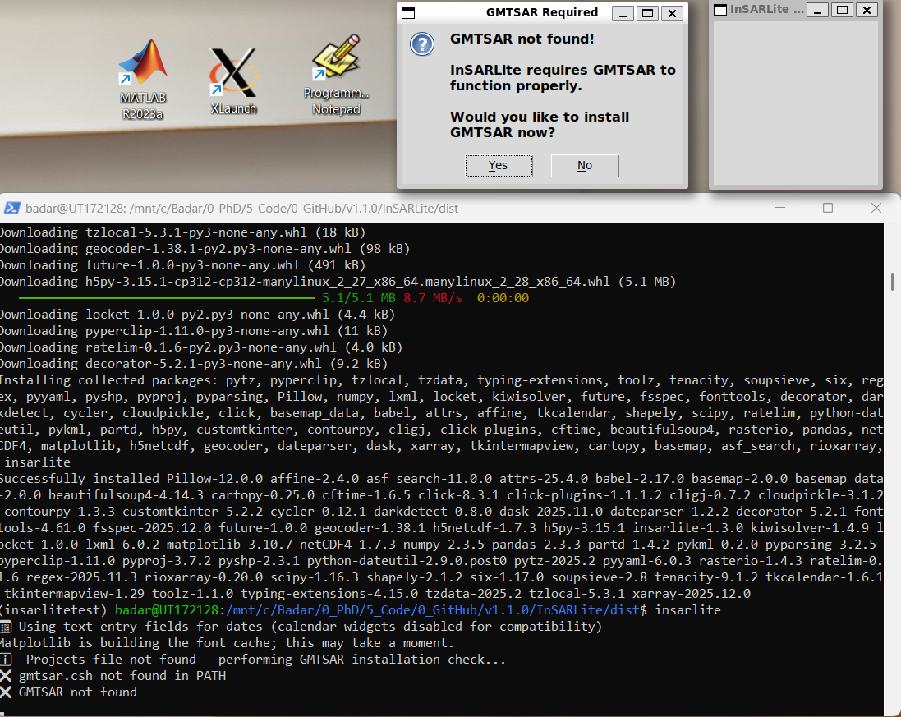

On first launch, InSARLite automatically checks for GMTSAR installation. If GMTSAR is not found, you'll see this prompt offering automatic installation.

**What's shown**: Main GUI is initially blank and compact. A prompt indicates GMTSAR is not found with the terminal output visible.

**User Action**: Click **Yes** to proceed with automatic installation.

### Step 1.2: Installation Mode Selection

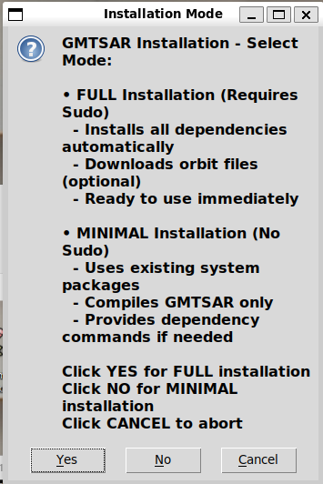

Choose between two installation modes:

- **Full Installation**: Includes all GMTSAR components, dependencies, and full functionality
- **Minimal Installation**: Basic functionality only (not recommended for this tutorial)

**User Action**: Select **Full Installation** for complete functionality.

### Step 1.3: Optional Orbit Files

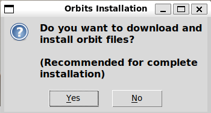

InSARLite can pre-download Sentinel-1 orbit files to save time later. This is optional as orbits can be downloaded on-demand.

**User Action**: Click **No** (orbits will be downloaded automatically when needed).

### Step 1.4: Authentication

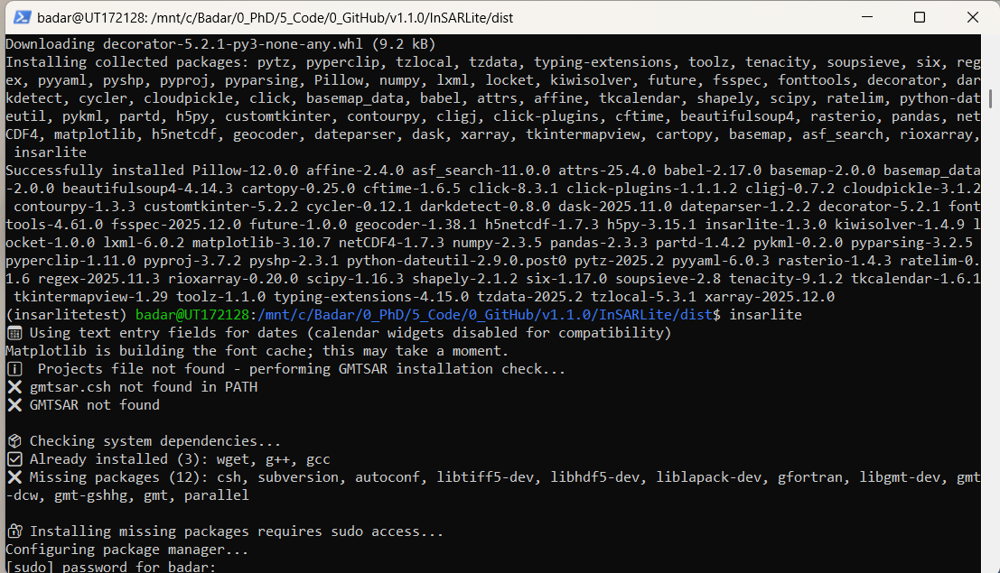

Full installation requires administrator privileges to install system dependencies.

**User Action**: Enter your sudo password when prompted.

### Step 1.5: Installation Confirmation

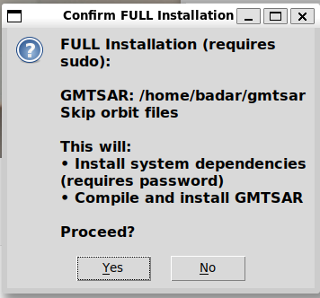

Review your selected options before proceeding:
- Installation mode: Full
- Orbit files: No
- System modifications will be made

**User Action**: Click **Yes** to confirm and start installation.

### Step 1.6: Installation Complete

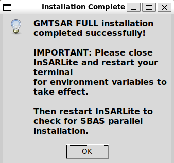

Installation successful! InSARLite recommends restarting to ensure environment variables are properly loaded.

**User Action**: Click **OK**.

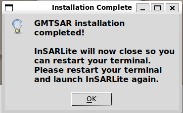

InSARLite will now close to allow environment refresh.

**User Action**: Click **OK**.

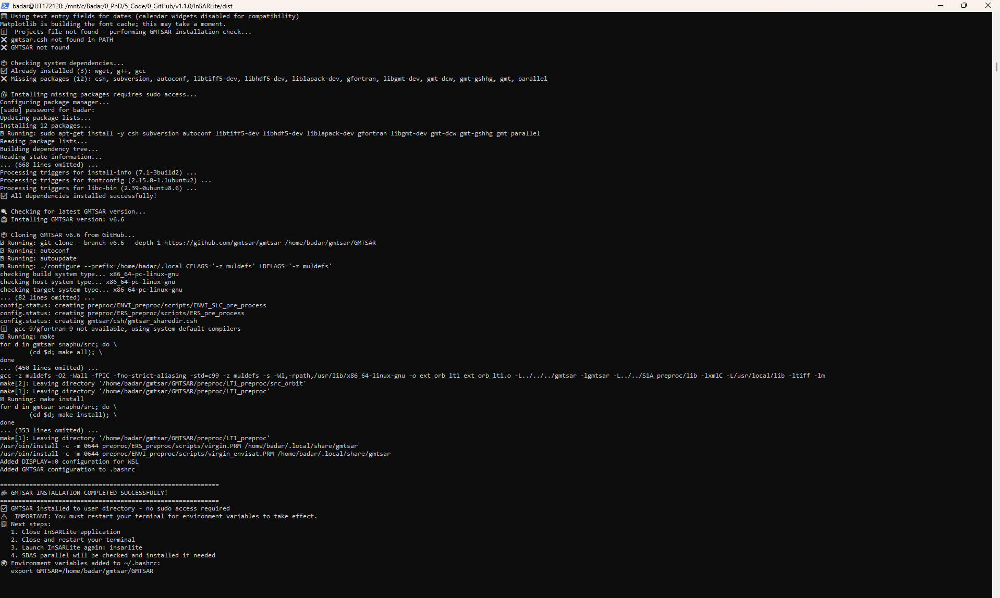

Terminal output confirms successful installation with all components properly configured.

### Step 1.7: Verification

After restarting InSARLite, the main GUI will launch normally. You can verify GMTSAR installation by checking the terminal or running:

```bash
gmtsar.csh
```

If installation was successful, you'll see GMTSAR version information.

---

## Part 2: Project Configuration

### Step 2.1: Define Data Folder

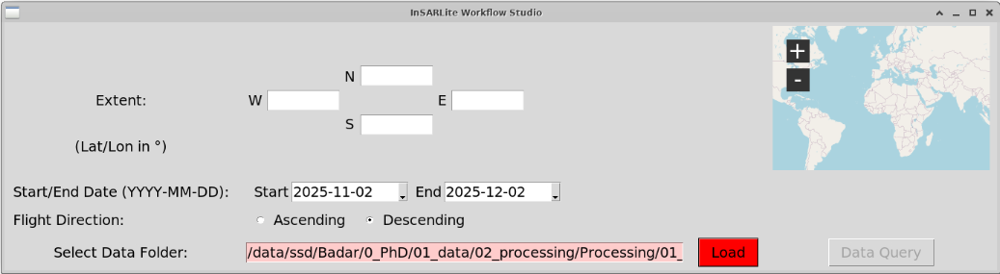

**What's shown**: Main GUI with data folder defined as an empty directory. Red textbox background and red "Load" button indicate missing data.

**User Action**: 
1. Click **Browse** to select an empty folder for your project
2. This folder will contain all downloaded and processed data

### Step 2.2: Define Area of Interest (AOI)

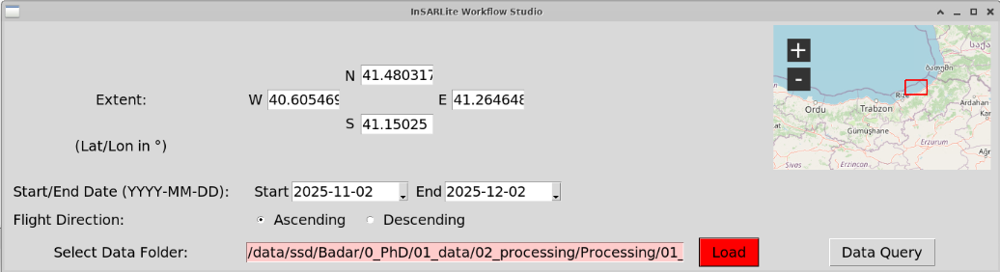

**What's shown**: Bounding box drawn on the interactive map, encompassing the Güngören landslide area. The map widget displays Sentinel-1 frame footprints and AOI extent.

**User Action**: 
1. Use the map tools to draw a bounding box around your study area
2. The box should encompass the entire landslide region with some buffer
3. Click to set corners of the bounding box

**Tip**: Include surrounding stable areas for reference point selection later.

### Step 2.3: Define Temporal Range

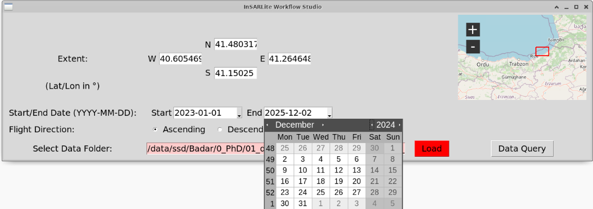

**What's shown**: Calendar widget for selecting the end date of the analysis period.

**User Action**: 
1. Set start date to capture sufficient pre-failure baseline
2. Set end date to include the failure event and some post-failure data
3. For this study: Start ~early 2023, End ~late 2024

**Recommended**: For landslide monitoring, include at least 12-18 months of data.

### Step 2.4: Query Available Data

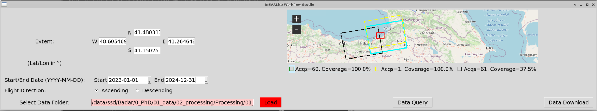

**What's shown**: Query results showing available Sentinel-1 scenes that match the AOI and temporal criteria. Frame information and acquisition count are displayed.

**User Action**: 
1. Review the query results
2. Check the number of available acquisitions (should show ~60 scenes)
3. Select the appropriate frame for download
4. Click **Download Selected**

**Note**: This query uses NASA's Alaska Satellite Facility (ASF) API.

### Step 2.5: Download Sentinel-1 Data

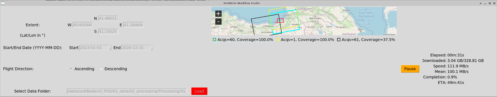

**What's shown**: Active download progress with status indicators.

**What happens**: InSARLite downloads all selected Sentinel-1 .zip files from ASF to your data folder. Progress is shown in real-time.

**Download size**: 328.8 GB total (60 acquisitions: 23 files @ ~7.5 GB each, 37 files @ ~4.2 GB each)

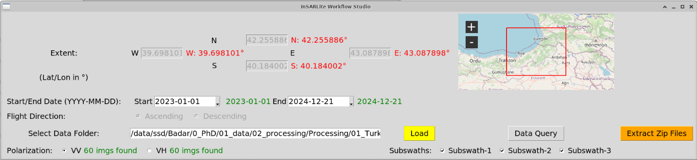

**What's shown**: GUI state when download completes. All .zip files are now in the data folder.

**User Action**: Click **OK** or proceed to extraction.

### Step 2.6: Extract Sentinel-1 Data


**What's shown**: Extraction confirmation prompt with additional parameter options.

**User Action**: 
1. Select subswath (IW2/F2 for this study)
2. Click **Extract**
3. Confirm extraction in the prompt

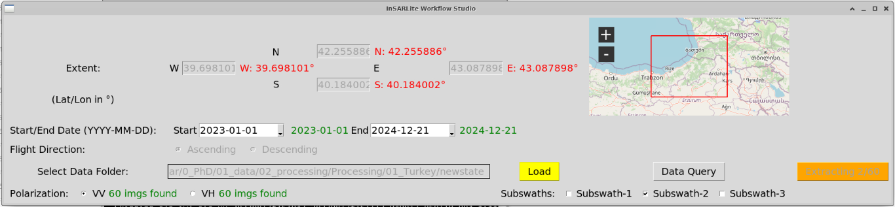

**What's shown**: GUI state during extraction process.

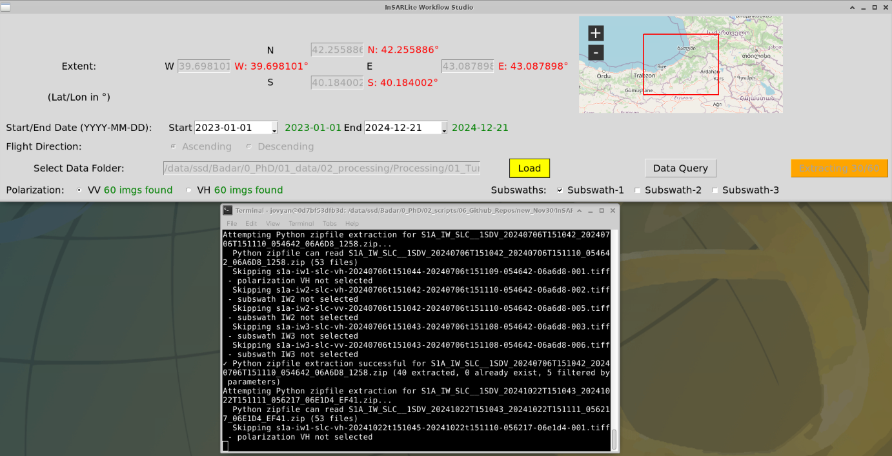

**What's shown**: Detailed terminal output during extraction showing individual file processing.

**What happens**: InSARLite extracts .SAFE directories from .zip files, organizing data for GMTSAR processing.

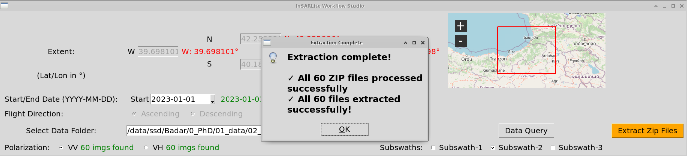

**What's shown**: Extraction complete prompt with main GUI in background.

**User Action**: Click **OK**.

### Step 2.7: Validate Data

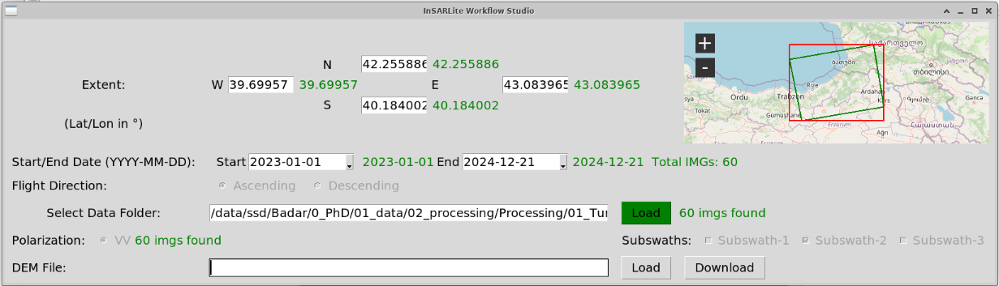

**What's shown**: GUI state showing valid SAFE directories confirmed. The data folder now contains properly extracted and organized Sentinel-1 data.

**What happens**: InSARLite automatically validates the extracted data structure, checking for:
- Correct .SAFE directory format
- Required XML metadata files
- Measurement data files
- Consistent subswath selection

**Status indicators**: Green confirmation shows all 60 acquisitions are valid.

### Step 2.8: Download DEM

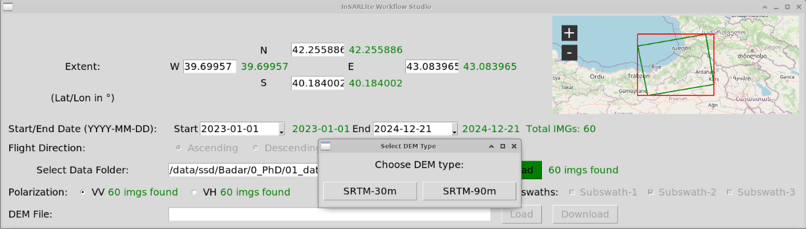

**What's shown**: DEM download prompt with resolution options.

**User Action**: 
1. Click **Download DEM**
2. Select resolution:
   - **SRTM 1 arc-second (~30m)**: Higher resolution, recommended
   - **SRTM 3 arc-second (~90m)**: Faster download, lower resolution

**Recommendation**: Use 30m DEM for detailed landslide analysis.

**What happens**: InSARLite automatically downloads SRTM DEM tiles covering your AOI and creates a merged, properly formatted DEM for GMTSAR.

### Step 2.9: Define Output Configuration

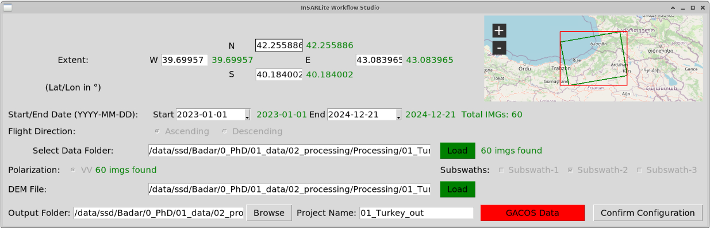

**What's shown**: Main GUI state when all required parameters are defined but configuration not yet confirmed.

**Parameters shown**:
- Data folder: Populated with valid data
- AOI: Defined on map
- Temporal range: Set
- DEM: Downloaded
- Output folder: To be specified
- Project name: To be specified

**User Action**: 
1. Specify output folder location
2. Enter a descriptive project name (e.g., "Gungoren_Landslide_2024")
3. **Do not click "Confirm Configuration" yet**

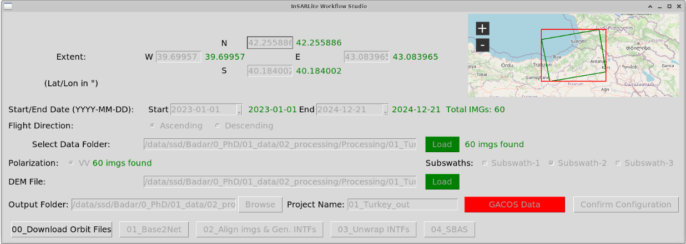

**What's shown**: Main GUI state after clicking "Confirm Configuration".

**What happens**: InSARLite creates the complete directory structure for GMTSAR processing:

```
output_folder/asc/
├── data/          # Symlinks to original SAFE directories from data folder, orbit files
├── F2/             # IW2 subswath processing folder
│   ├── raw/        # Symlinks to IW2 files, baseline files, aligned images
│   ├── intf/       # Interferograms temporary directory
│   ├── intf_all/   # Interferograms (moved here after creation)
│   └── topo/       # DEM and topographic products
├── SBAS/           # Time series results
├── topo/           # DEM and topographic products
└── reframed/       # Location of pin.ll file with coordinates of two pins covering S1 frame
```

**User Action**: Click **Confirm Configuration**.

**Status**: Project is now fully configured and ready for processing!

---

## Part 3: Baseline Network Design (Step 1)

### Step 3.1: Download Precise Orbit Files

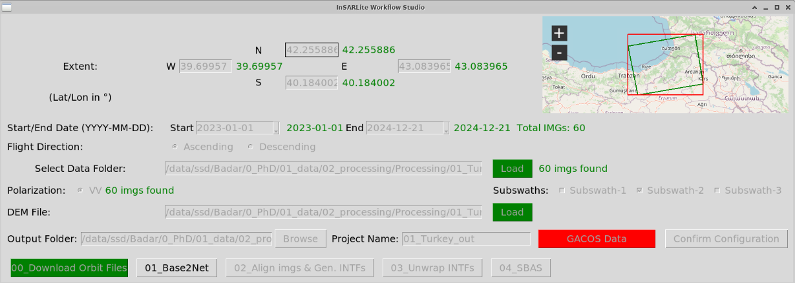

**What's shown**: GUI state after Step 00 (orbit download) completion.

**User Action**: Click **00_Download Precise Orbits**.

**What happens**: InSARLite automatically downloads precise orbit ephemerides (POE) files from ESA for all 60 acquisitions. These files provide accurate satellite positions essential for interferometric processing.

**Processing time**: 2-5 minutes (depends on internet speed).

### Step 3.2: Open Baseline Calculator (Base2Net)

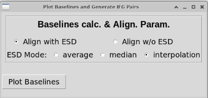

**What's shown**: "Baseline calc. & Align. Param." controls in default state.

**Parameters visible**:
- ESD (Enhanced Spectral Diversity) options
- Alignment parameters
- Default selections loaded

**User Action**: Review default parameters, then click **Calculate Baselines**.

### Step 3.3: Plot Baselines

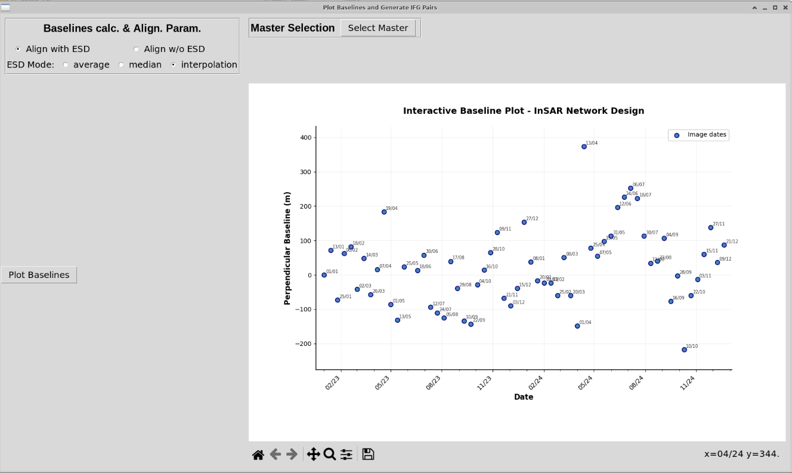

**What's shown**: Base2Net interface with baselines plotted on the temporal-perpendicular baseline graph.

**Graph shows**: All 60 acquisitions plotted with:
- X-axis: Date (mm/yy format), with each point labeled as dd/mm and positioned by temporal baseline
- Y-axis: Perpendicular baseline (meters)

**User Action**: Click **Select Master** to proceed with master image selection.

**Interpretation**: The baseline plot shows the spatial-temporal distribution of acquisitions. Widely scattered acquisitions require careful master selection to minimize decorrelation.

### Step 3.4: Calculate Master Table

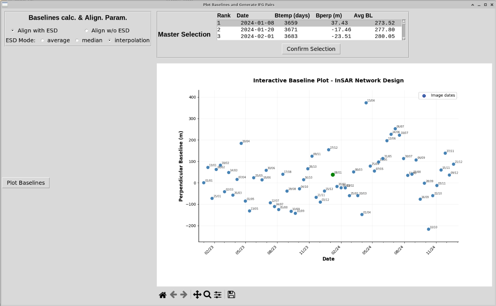

**What's shown**: Master table calculated and displayed, ranking all acquisitions by suitability as master image.

**What's calculated**: Network centrality for each acquisition using:

$$C_i = \sum_{j=1}^{N} w_{ij}$$

where:

$$w_{ij} = \begin{cases} 
1 & \text{if } |B_{\perp,ij}| < B_{\text{crit}} \text{ and } |T_{ij}| < T_{\text{crit}} \\
0 & \text{otherwise}
\end{cases}$$

- $C_i$ = centrality score for acquisition $i$
- $B_{\perp,ij}$ = perpendicular baseline between acquisitions $i$ and $j$
- $T_{ij}$ = temporal baseline between acquisitions $i$ and $j$
- $B_{\text{crit}}$ = critical perpendicular baseline (typically 150-300m)
- $T_{\text{crit}}$ = critical temporal baseline (typically 48-96 days)

**Table columns**:
- **Rank**: Sorted by ascending average baseline (lowest = best)
- **Date**: Acquisition date
- **Btemp (days)**: Temporal baseline value relative to first acquisition
- **Bperp (m)**: Mean perpendicular baseline relative to other acquisitions  
- **Avg BL**: Average baseline metric (corresponds to centrality score)

**Best master**: Acquisition with lowest average baseline (highest centrality score = most connections to other scenes).

### Step 3.5: Select Master Image

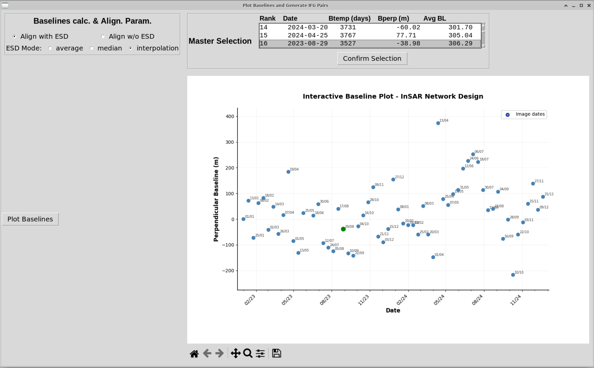

**What's shown**: Entry ranked 16 selected as master image.

**Master Details**:
- Date: August 29, 2023
- Rank: 16 (not optimal by average baseline metric)

**Rationale for Rank 16 Selection**: 

This tutorial intentionally selects rank 16 (rather than rank 1) to demonstrate an important SBAS concept:

**SBAS vs PSI Master Selection**:
- **PSI (Persistent Scatterer)**: Requires optimal master with lowest average baseline because ALL interferograms reference this single master. Master quality critically affects entire dataset coherence.
- **SBAS (Small Baseline Subset)**: Uses multi-master configuration where interferograms are formed between temporally adjacent acquisitions. The "master" only serves as an alignment reference for image coregistration, not as a single interferometric reference.

In SBAS processing, master selection is far less critical than in PSI because:
1. Each interferogram uses its own optimal pair (small temporal/spatial baselines)
2. Time series inversion handles multiple reference configurations
3. Coherence is maintained through small baseline subsets, not single-master connectivity

**User Action**: 
1. Review the ranked list
2. Select rank 16 (as demonstrated) or rank 1 (optimal by metric)
3. Click **Confirm Selection**

**Educational note**: For SBAS, any reasonably connected acquisition works as master. For PSI, always select rank 1.

### Step 3.6: Define Baseline Constraints

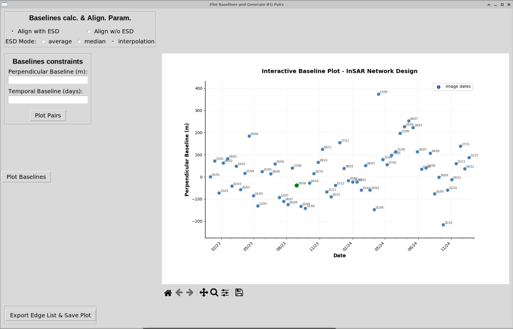

**What's shown**: Baseline constraints controls now visible after master selection.

**User Action**: Define thresholds for interferogram pair selection:
1. **Perpendicular baseline threshold**: Maximum spatial baseline (in meters)
2. **Temporal baseline threshold**: Maximum time separation (in days)

**Preparation**: Ready to define constraints and generate interferometric pairs.

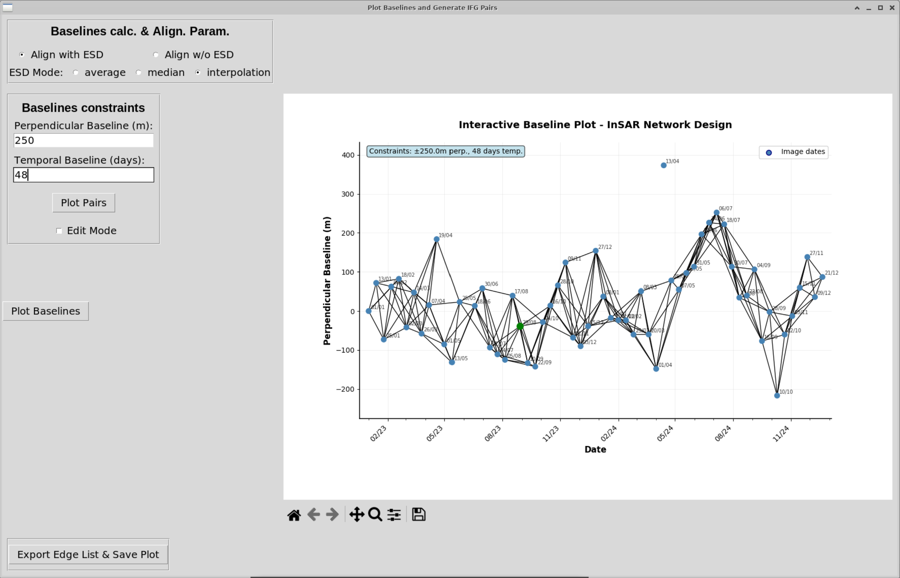

**What's shown**: Constraints defined and interferometric pairs plotted.

**Constraints used**:
- Perpendicular baseline: 250 meters (maximum)
- Temporal baseline: 48 days (maximum)

**Graph shows**: Network connections between master and slave acquisitions that meet the criteria. Lines represent interferometric pairs to be generated.

**User Action**: Click **Plot Pairs** to visualize the network.

**Network characteristics**:
- Small Baseline Subset (SBAS) approach
- Ensures sufficient temporal sampling
- Minimizes decorrelation effects
- Creates redundant network for robust inversion

### Step 3.7: Export Network Configuration

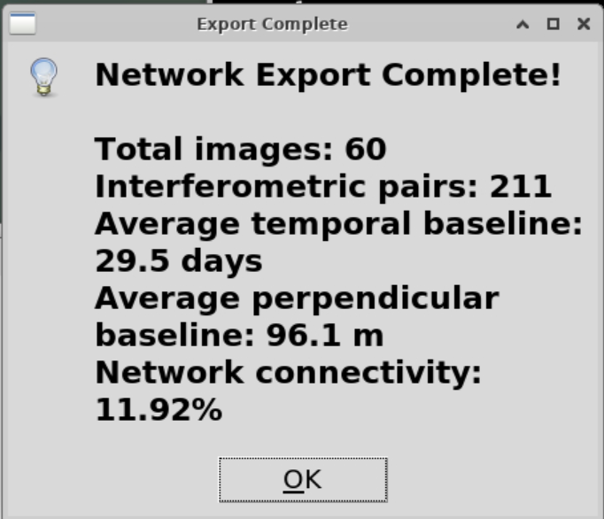

**What's shown**: Export complete prompt.

**What's exported**:
- `baseline_table.dat`: Baseline information for all pairs
- `intf.in`: List of interferometric pairs to generate
- Network configuration plots (PNG/PDF)

**User Action**: Click **Export**.

**Files created**: These files are used by GMTSAR in subsequent processing steps.

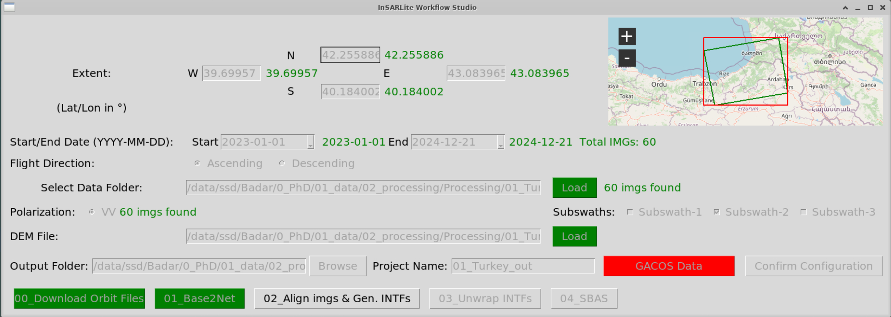

**What's shown**: Back to main GUI after Base2Net process completion.

**Status**: Step 1 (Baseline Network Design) is complete. The GUI now shows:
- Green/completed status for Step 1
- Step 2 (Align & Generate IFGs) now active and ready

**User Action**: Click **OK** on the completion prompt.

**Summary**: You've successfully:
- Downloaded precise orbits
- Calculated baselines for all acquisitions
- Selected an optimal master image (Aug 29, 2023)
- Defined network constraints (250m, 48 days)
- Generated interferometric pair list
- Exported configuration for GMTSAR

---

## Part 4: Interferogram Generation (Step 2)

### Step 4.1: Configure IFG Parameters

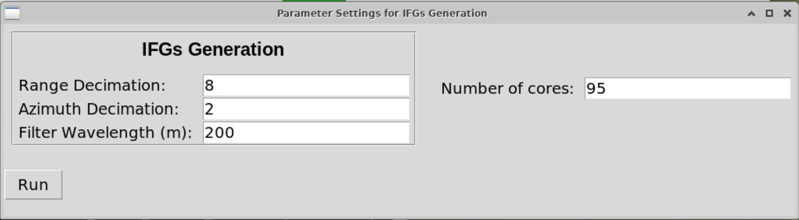

**What's shown**: Interferogram generation GUI with default parameters.

**Key parameters**:
- **Range decimation**: Reduces resolution in range direction (trade-off: speed vs. detail)
- **Azimuth decimation**: Reduces resolution in azimuth direction
- **Filter wavelength**: Gaussian filter for noise reduction (in meters)
- **Processing cores**: Number of parallel threads (use all available)

**Default values**: Generally optimal for most applications.

**User Action**: 
1. Review parameters (defaults are good for this tutorial)
2. Adjust cores to match your CPU (e.g., 8 cores)
3. Click **Run**

**Recommendation**: For landslide analysis, use minimal decimation to preserve detail.

### Step 4.2: Confirm Execution

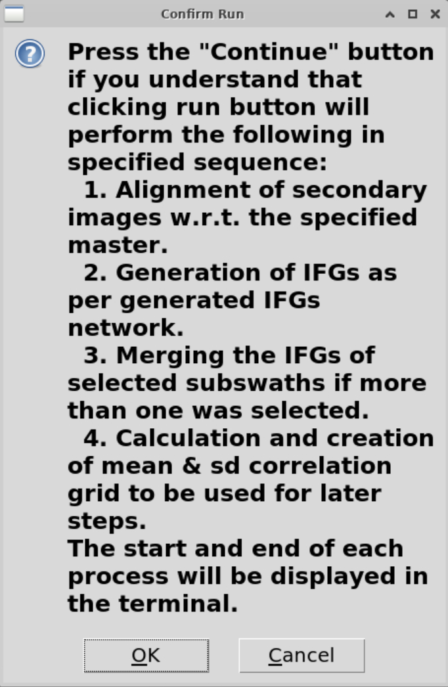

**What's shown**: Confirmation prompt reviewing settings before execution.

**What will happen**:
1. Align all SAR images to master geometry
2. Generate interferograms for all pairs in `intf.in`
3. Calculate mean correlation (coherence)
4. Prepare data for unwrapping

**Processing time estimate**: 2-3 hours (depends on number of pairs and CPU cores).

**User Action**: Click **OK** to start processing.

### Step 4.3: Monitor Processing Progress

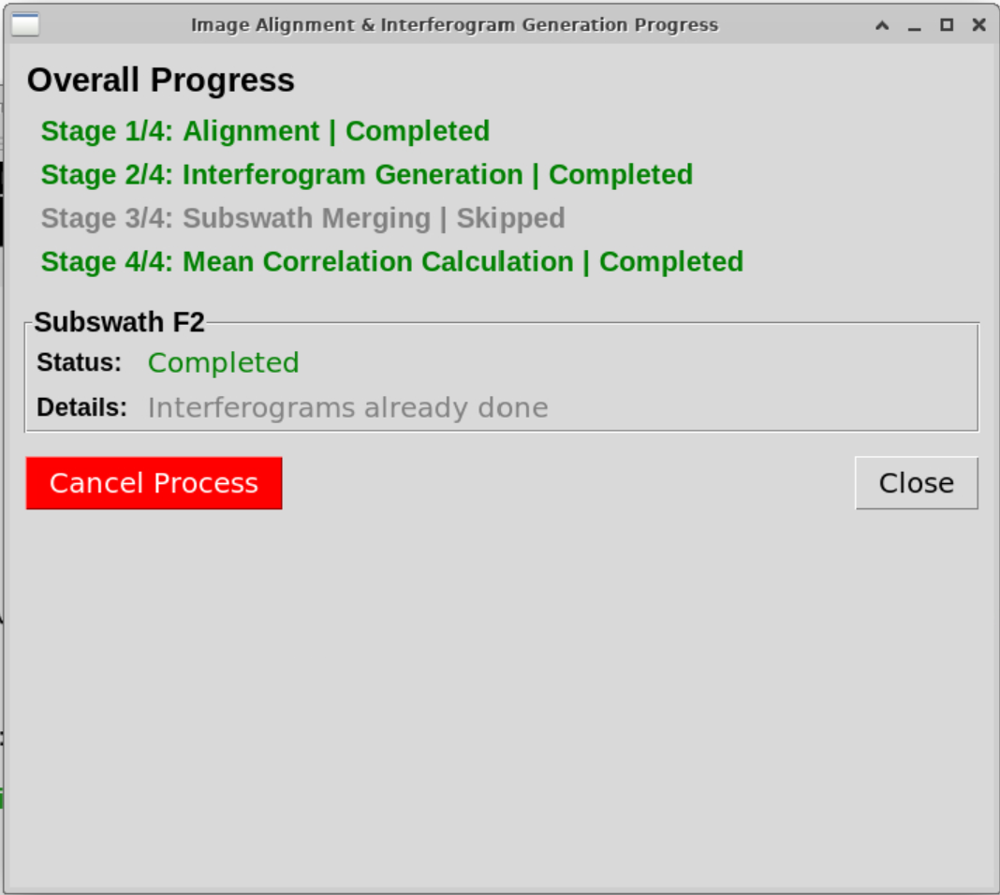

**What's shown**: Progress GUI showing processing stages 1-4.

**Processing stages**:
1. **Stage 1**: Image alignment to master
   - Co-registers all acquisitions to master geometry
   - Creates aligned SLC images
   
2. **Stage 2**: Interferogram generation
   - Computes complex interferograms for all pairs
   - Applies topographic phase removal using DEM
   - Generates wrapped phase products
   
3. **Stage 3**: Subswath merging
   - **Skipped** (only F2/IW2 being processed)
   - Would merge IW1, IW2, IW3 if multiple subswaths selected
   
4. **Stage 4**: Mean correlation calculation
   - Computes average coherence across all interferograms
   - Creates `corr_avg.grd` and `corr_std.grd`
   - Used later for mask definition

**Real-time updates**: Terminal output shows detailed progress for each pair.

**User Action**: Monitor progress, close window when complete.

**What's created**:

```
F2/
├── SLC/              # Aligned SAR images
│   └── *.SLC         # Single Look Complex images (all aligned to master)
├── intf_all/         # All interferograms
│   └── 2023XXX_2024XXX/
│       ├── phasefilt.grd     # Filtered wrapped phase
│       ├── corr.grd           # Coherence/correlation
│       └── phasefilt_mask.grd # Masked phase
├── corr_avg.grd      # Mean correlation (for masking)
└── corr_std.grd      # Correlation std deviation
```

**Processing complete**: Step 2 finished. Ready for unwrapping!

---

## Part 5: Phase Unwrapping (Step 3)

Phase unwrapping is the most complex step, involving four distinct phases:
1. Mask definition
2. First unwrapping
3. Reference point selection
4. Unwrapping completion

### Phase 1: Mask Definition

#### Step 5.1.1: Open Unwrap Interface

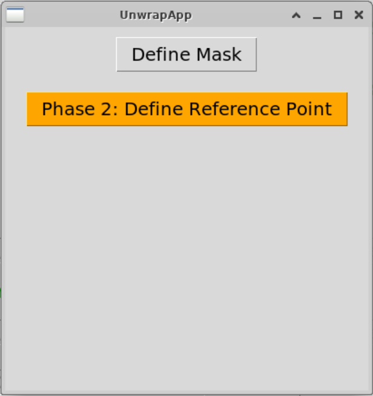

**What's shown**: Default UnwrapApp state showing two main buttons:
- **Def[ine Mask]**: Create/modify unwrapping mask
- **Phase 2**: Currently inactive (will activate after Phase 1)

**User Action**: Click **Def** to define the unwrapping mask.

**Why mask?**: Unwrapping is only reliable in coherent areas. A mask excludes low-coherence pixels to prevent error propagation.

#### Step 5.1.2: Handle Existing Mask

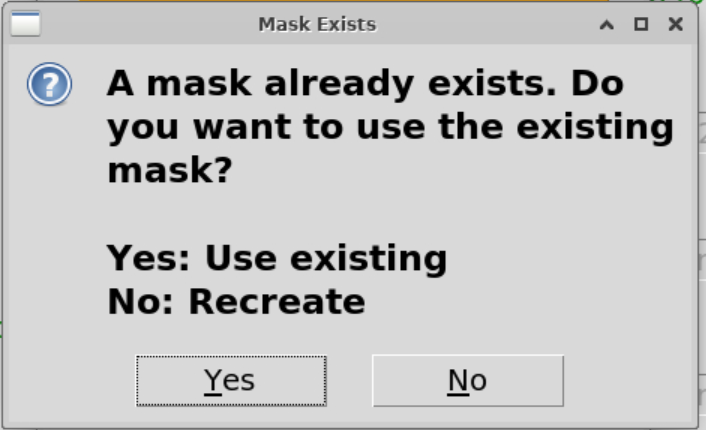

**What's shown**: Prompt indicating a mask already exists (perhaps from previous run).

**User Action**: Click **Yes** to recreate the mask fresh.


**What's shown**: Confirmation to delete existing mask and create new one.

**User Action**: Click **Yes** to delete and recreate.

#### Step 5.1.3: Define Correlation Threshold


**What's shown**: Mean correlation GUI for threshold-based masking.

**Parameters**:
- **Threshold**: 0.08 (correlation values below this are masked out)
- Display shows mean correlation map

**User Action**: 
1. Set threshold to 0.08 (good starting point for landslide areas)
2. Click **Update Mask**
3. Visualize the mask on the correlation map

**Interpretation**: 
- Blue/low values: Low coherence (water, vegetation, steep slopes)
- Red/high values: High coherence (bare ground, stable areas)
- Threshold of 0.08 excludes very low coherence while retaining landslide area

#### Step 5.1.4: Add Polygon Mask

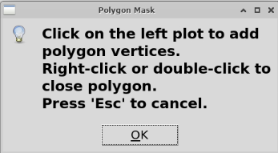

**What's shown**: Polygon mask prompt offering option to add manual delineation.

**Why polygon?**: Sometimes you want to:
- Focus on specific area of interest
- Exclude problematic regions manually
- Refine threshold-based mask

**User Action**: Click **Polygon** to draw manual mask.

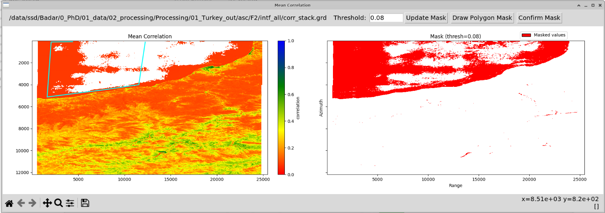

**What's shown**: One polygon drawn on the correlation map (cyan outline).

**User Action**: 
1. Click to place vertices around your area of interest
2. Right-click to complete the polygon
3. Polygon encloses the landslide area

**Tip**: Include some stable area outside the landslide for reference.

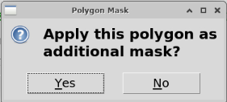

**What's shown**: Polygon mask confirmation prompt.

**User Action**: Click **Yes** to confirm the polygon.

#### Step 5.1.5: Visualize Composite Mask

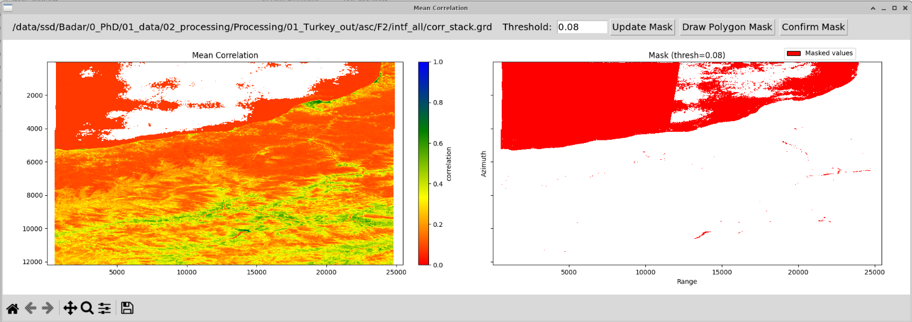

**What's shown**: Composite mask displayed combining:
- Correlation threshold (0.08)
- Polygon mask (manual delineation)

**Mask logic**: Only pixels that satisfy BOTH conditions are included:
- Correlation > 0.08 AND
- Inside polygon

**Result**: A refined mask focusing on coherent pixels within the landslide area.

#### Step 5.1.6: Export Mask

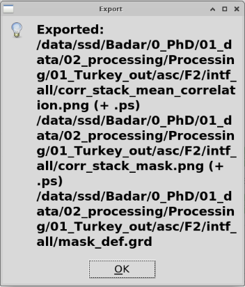

**What's shown**: Export prompt.

**What's exported**: Mask file applied to all interferograms for unwrapping.

**User Action**: Click **Export**.

**File created**: `mask_def.grd` used in unwrapping.

### Phase 2: First Unwrapping

#### Step 5.2.1: Run Phase 1 Unwrapping

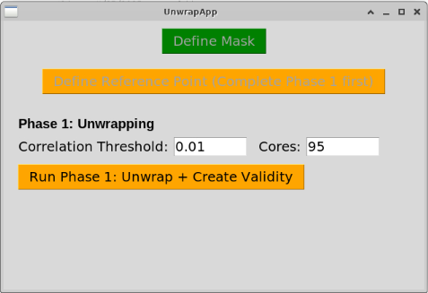

**What's shown**: Back to UnwrapApp after defining mask.

**Status**: Mask is defined and exported. Ready for first unwrapping pass.

**User Action**: Click **Run Phase 1:...**

**What happens**: GMTSAR's SNAPHU unwrapper runs on all interferograms with the defined mask.

#### Step 5.2.2: Unwrapping Completion

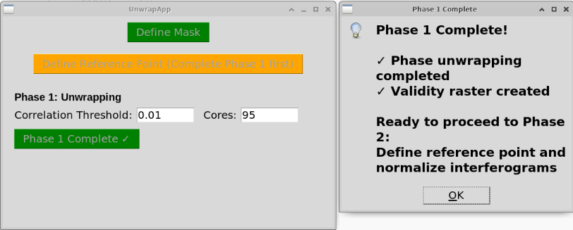

**What's shown**: Phase 1 completed with parameters:
- **Threshold**: 0.01 (default SNAPHU threshold)
- **Patch size**: 95 (default patch size for parallel unwrapping)

**Processing**: SNAPHU uses statistical-cost, network-flow algorithm for phase unwrapping.

**User Action**: Click **OK**.

**What's created**: Unwrapped phase files for all interferograms.

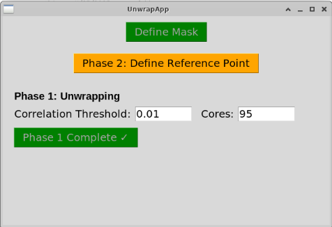

**What's shown**: Phase 2 controls now active after Phase 1 completion.

**Status**: Interferograms are unwrapped but not yet normalized to a common reference point.

**User Action**: Proceed to reference point selection (Phase 3).

### Phase 3: Reference Point Selection

#### Step 5.3.1: Check for Existing Reference

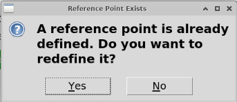

**What's shown**: Prompt indicating reference point already exists.

**User Action**: Click **Yes** to redefine reference point.

**Why redefine?**: You may want to change reference point for better stability or scientific reasons.

#### Step 5.3.2: Open Enhanced Reference Point Selection

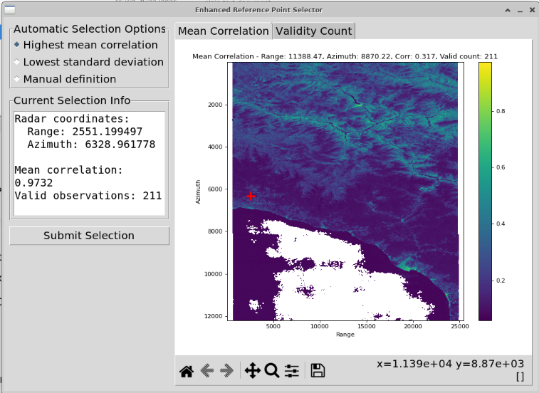

**What's shown**: Enhanced reference point selection interface with multiple selection methods.

**Default selection**: "Highest mean corr" is automatically selected, showing the location with highest average coherence.

**Why this matters**: The reference point should be:
- Stable (no deformation)
- Highly coherent (reliable phase measurements)
- Outside the deforming area

**Display**: Mean correlation map with cursor showing current reference point location.

#### Step 5.3.3: Explore Selection Options

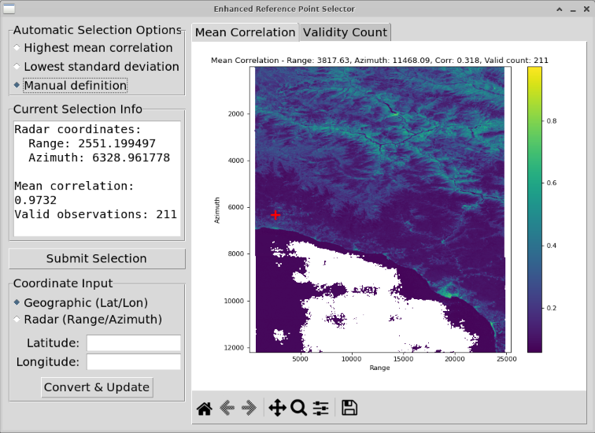

**What's shown**: Manual definition controls visible.

**Selection methods available**:
1. **Automated**:
   - Highest mean correlation (recommended)
   - Lowest correlation std deviation
   
2. **Manual**:
   - Click on mean correlation map
   - Click on validity count map
   - Enter coordinates directly (Geographic or Radar)

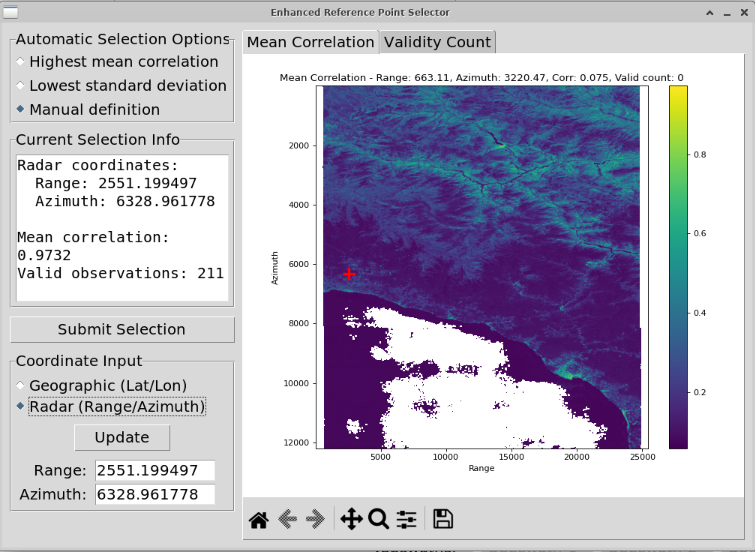

**What's shown**: Radar coordinate option selected for manual entry.

**Coordinate systems**:
- **Radar**: Range and azimuth pixel coordinates
- **Geographic**: Latitude and longitude

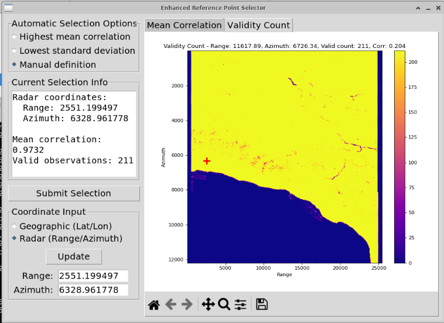

**What's shown**: Validity Count tab active with radar coordinates.

**Validity count**: Number of interferograms with valid unwrapped phase at each pixel.

**Use case**: Select reference point with maximum validity (appears in most interferograms).


**What's shown**: Different location clicked on validity map, values updated.

**Interactive**: Click anywhere on the map to evaluate potential reference points.

**Evaluation criteria**:
- High mean correlation
- Low correlation std deviation
- High validity count
- Located in stable area (away from landslide)

#### Step 5.3.4: Confirm Reference Point

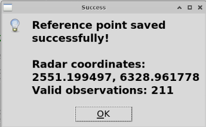

**What's shown**: Success prompt after selecting reference point.

**Reference selected**: Highest mean correlation location (automated selection).

**Coordinates**: 
- Range: 2551.199497
- Azimuth: 6328.961778

**User Action**: Click **OK** to apply reference point.

**What happens**: All interferograms are normalized to this reference point, setting it as zero deformation.

### Phase 4: Unwrapping Completion

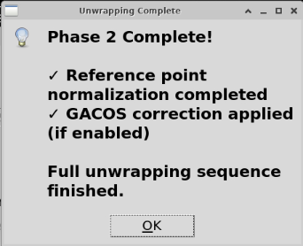

**What's shown**: Unwrapping complete prompt.

**Status**: All interferograms are:
- ✅ Unwrapped
- ✅ Masked
- ✅ Normalized to reference point
- ✅ Ready for SBAS inversion

**User Action**: Click **OK**.

**Files created**:

```
F2/intf_all/2023XXX_2024XXX/
├── unwrap.grd           # Unwrapped phase
├── unwrap_mask.grd      # Unwrapped phase with mask
├── phase.grd            # Wrapped phase
└── corr.grd             # Coherence
```

**Summary**: Step 3 complete! You've successfully:
- Created a composite mask (threshold + polygon)
- Unwrapped all interferograms
- Selected optimal reference point
- Normalized all phases to common reference

---

## Part 6: SBAS Inversion and Visualization (Step 4)

### Step 6.1: Configure SBAS Parameters

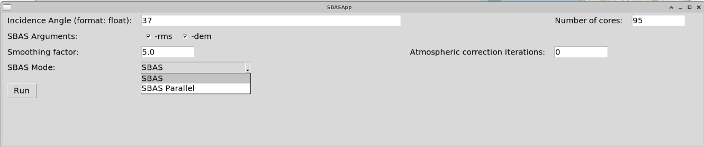

**What's shown**: SBASApp interface with SBAS Mode dropdown clicked.

**SBAS modes**:
- **SBAS (standard)**: Sequential processing
- **SBAS parallel**: Multi-core parallel processing (faster)

**User Action**: Select **SBAS parallel** for faster processing.

**Other parameters**:
- **Smoothing**: Spatial smoothing factor (0.0 = no smoothing)
- **Atmospheric iterations**: Number of iterations for atmospheric correction (default: 3)
- **Wavelength**: Radar wavelength (auto-set for Sentinel-1)

### Step 6.2: Confirm Existing Displacement Files

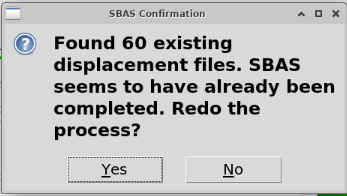

**What's shown**: SBAS confirmation prompt indicating 60 existing displacement files found.

**What this means**: All interferograms have been successfully unwrapped and are ready for inversion.

**User Action**: Click **OK** to proceed.

**Background**: SBAS requires `disp_*.grd` files (unwrapped phase converted to line-of-sight displacement) for each interferogram.

### Step 6.3: Execute SBAS Inversion

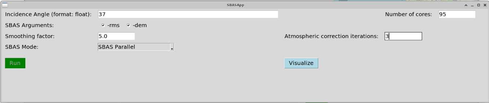

**What's shown**: SBAS completed successfully with parameters:
- **Mode**: SBAS parallel
- **Atmospheric iterations**: 3
- **Smoothing**: 0.0 (default)

**What happened**: Small Baseline Subset inversion solved for displacement time series at each pixel.

**SBAS method**: Solves the following system for each pixel:

$$\mathbf{G} \mathbf{m} = \mathbf{d}$$

where:
- $\mathbf{G}$ = design matrix (network geometry)
- $\mathbf{m}$ = displacement time series (unknowns)
- $\mathbf{d}$ = observed interferometric phase (data)

**Solution**: Least-squares inversion with optional smoothing:

$$\mathbf{m} = (\mathbf{G}^T \mathbf{G} + \alpha \mathbf{L})^{-1} \mathbf{G}^T \mathbf{d}$$

where $\alpha$ = smoothing factor, $\mathbf{L}$ = Laplacian operator.

**Status**: "Visualize" button now active (cyan).

**User Action**: Click **Visualize** to launch interactive visualization.

**Files created**:

```
F2/SBAS/
├── disp_YYYYMMDD.grd    # Displacement at each epoch
├── vel.grd              # Mean velocity (mm/yr)
├── rms.grd              # RMS of fit (optional)
└── dem_error.grd        # DEM error estimate (optional)
```

### Step 6.4: Launch Surface Deformation Visualizer

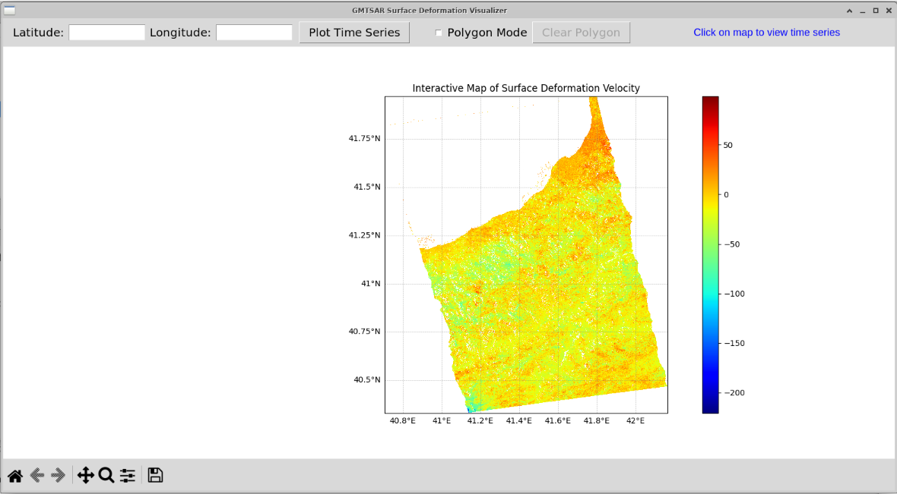

**What's shown**: Default visualization showing mean LOS velocity map.

**Features**:
- **Interactive map**: Pan, zoom, click pixels
- **Color scale**: Velocity in mm/yr
- **Deformation pattern**: Clear signal in landslide area
- **Basemap**: Coordinate grid and frame extent

**Automatic processing on launch**:
1. ✅ Reproject velocity to geographic coordinates
2. ✅ Create velocity KML for Google Earth
3. ✅ Reproject time series to geographic coordinates
4. ✅ Load all time series into memory
5. ✅ Generate interactive velocity map

**Interactive capabilities**:
- Click any pixel → view time series
- Zoom and pan
- Export plots (PNG/EPS/PDF/SVG)
- Export data (CSV)
- Polygon mode for multi-pixel analysis

**Interpretation**: 
- **Red**: Movement toward satellite (uplift or eastward)
- **Blue**: Movement away from satellite (subsidence or westward)
- **Landslide area**: Strong blue signal indicating movement away from satellite (downslope motion with LOS component)

### Step 6.5: Polygon Mode Analysis

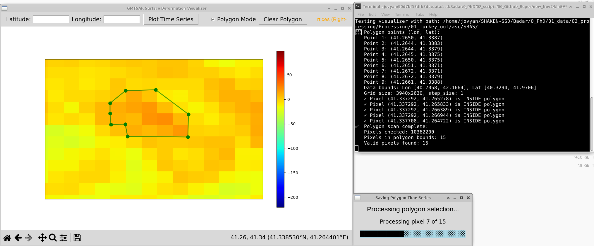

**What's shown**: Polygon Mode active with:
- Map zoomed to landslide area
- 9-vertex polygon drawn around deforming area
- Terminal messages showing processing progress
- Progress prompt: "Processing pixel 7 of 15"

**User Action**: 
1. Click **Polygon Mode** button
2. Zoom/pan to area of interest
3. Click to place vertices (9 vertices in this case)
4. Right-click to complete polygon
5. Confirm polygon
6. Wait for processing (15 pixels extracted)

**What happens**: InSARLite:
- Extracts all pixels within polygon
- Plots individual time series for each pixel
- Saves plots in multiple formats
- Saves data in CSV format
- Generates location maps

**Processing time**: ~30 seconds for 15 pixels.

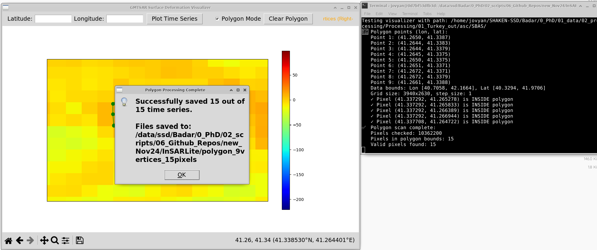

**What's shown**: Polygon processing complete with:
- Completion prompt displayed
- Terminal output showing successful completion
- All files saved notification

**User Action**: Click **OK**.

**Files generated** (for each pixel in polygon):

```
SBAS/time_series/polygon_9vertices_15pixels/
├── timeseries_N41p3373_E41p2658.png  # Time series plot
├── timeseries_N41p3373_E41p2658.eps  # Vector format
├── timeseries_N41p3373_E41p2658.pdf  # Vector format
├── timeseries_N41p3373_E41p2658.svg  # Vector format
├── timeseries_N41p3373_E41p2658.csv  # Raw data
├── timeseries_N41p3373_E41p2658_map.png  # Location map
└── ... (similar files for other 14 pixels)
```

**Total**: 6 files × 15 pixels = 90 files generated.

---

## Part 7: Results and Scientific Interpretation

### Step 7.1: Example Time Series Result

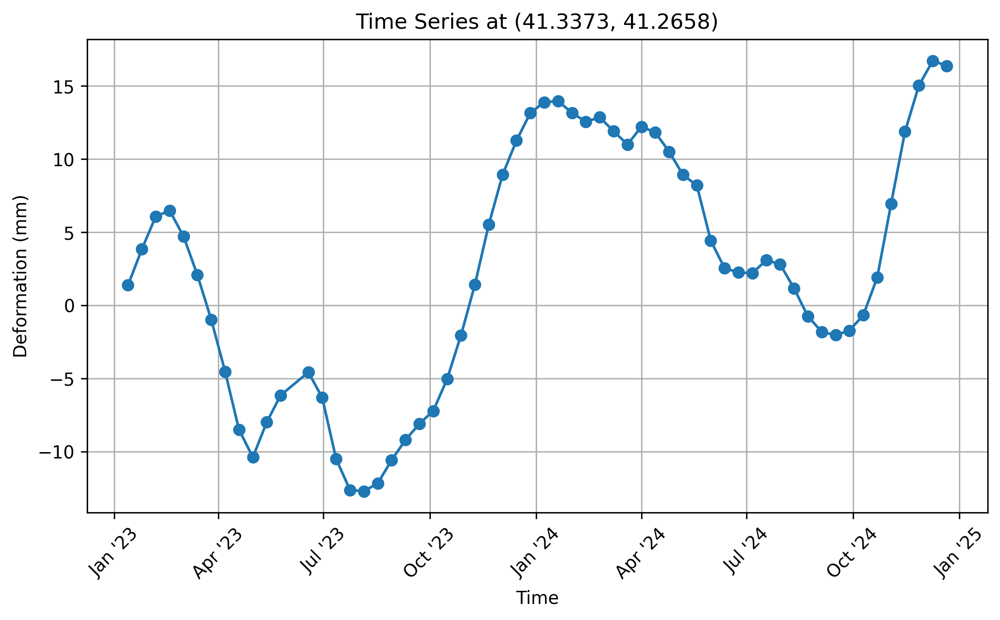

**What's shown**: Deformation time series for a pixel near the landslide crown (N41.3373°, E41.2658°).

**Plot elements**:
- X-axis: Time (dates from ~Feb 2023 to Dec 2024)
- Y-axis: Line-of-sight displacement (mm)
- Blue dots: Individual epoch measurements
- Red line: Trend (if fitted)

**Key observations**:
1. **Steady deformation**: Consistent negative trend through 2023
2. **Acceleration**: Noticeable increase in deformation rate in November 2024
3. **Pre-failure signal**: ~1 month of accelerated deformation before December 8, 2024 failure
4. **Total displacement**: ~35-40 mm cumulative LOS displacement

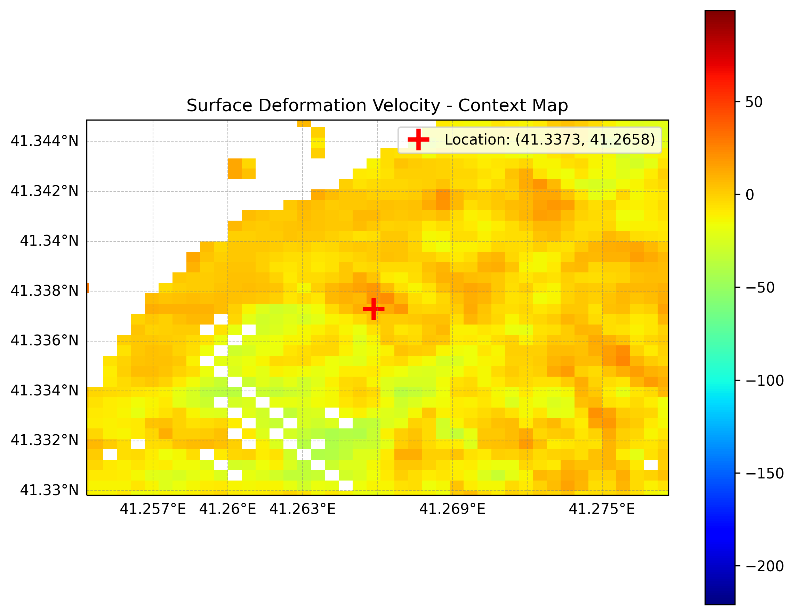

**What's shown**: Context map showing pixel location (red dot) on mean velocity background.

**Geographic context**:
- Pixel location relative to deformation pattern
- Surrounding velocity field
- Landslide extent visible in velocity map

### Step 7.2: Deformation Analysis

**Mean Annual Velocity**:
- Line-of-sight velocity (VLOS) reaches up to **25 mm/yr** in the source area
- Concentrated deformation around landslide crown
- Consistent spatial pattern across time series

**Time Series Characteristics**:
- **Baseline period** (early 2023): Relatively stable or slow deformation
- **Pre-failure acceleration** (November 2024): Measurable increase in deformation rate
- **Failure event** (December 8, 2024): Culmination of progressive slope failure
- **Post-failure**: Data availability pending (may show catastrophic displacement)

**Precursory Signal Detected**: 
✅ InSAR successfully captured the precursory deformation signal approximately one month before the catastrophic failure.

### Step 7.3: Scientific Significance

This analysis demonstrates several key capabilities of InSAR and InSARLite:

1. **Landslide Precursor Detection**:
   - InSAR can detect subtle surface deformation (mm-scale precision)
   - Acceleration patterns visible weeks to months before failure
   - Potential for early warning applications

2. **Temporal Monitoring**:
   - 60 acquisitions over 18 months provide dense temporal sampling
   - 12-day revisit enables detection of rapid changes
   - Time series reveals progression from stable → slow → accelerated → failure

3. **Spatial Coverage**:
   - Complete coverage of landslide area and surroundings
   - Identification of most active zones
   - Context of regional deformation patterns

4. **Validation of InSARLite**:
   - Automated workflow from raw data to scientific results
   - Publication-quality outputs
   - Real-world research application

**Reference**: Gorum et al., 2025 (documentation of Güngören landslide failure)

---

## Part 8: Output Files and Data Products

### Step 8.1: Project Directory Structure

After complete processing, your project folder contains:

```
project_folder/
├── raw/                          # Original data
│   └── *.SAFE/                   # Sentinel-1 SAFE directories
│
├── topo/                         # Topographic products
│   ├── dem.grd                   # DEM in radar coordinates
│   └── master.PRM                # Master image parameters
│
├── orbits/                       # Precise orbit files
│   └── S1*.EOF                   # ESA orbit files
│
└── F2/                           # IW2 subswath processing
    │
    ├── baseline_table.dat        # Baseline information
    ├── intf.in                   # Interferogram pair list
    ├── corr_avg.grd              # Mean correlation
    ├── corr_std.grd              # Correlation std deviation
    │
    ├── SLC/                      # Aligned SAR images
    │   ├── 2023XXXX.SLC          # Single Look Complex images
    │   └── 2023XXXX.PRM          # Parameter files
    │
    ├── intf_all/                 # All interferograms
    │   └── 2023XXXX_2024XXXX/    # Individual interferogram folders
    │       ├── phasefilt.grd     # Filtered wrapped phase
    │       ├── unwrap.grd        # Unwrapped phase
    │       ├── unwrap_mask.grd   # Masked unwrapped phase
    │       ├── corr.grd          # Coherence
    │       └── disp_*.grd        # LOS displacement
    │
    └── SBAS/                     # Time series results
        ├── disp_YYYYMMDD.grd     # Displacement at each epoch
        ├── vel.grd               # Mean velocity (radar coords)
        ├── vel_ll.grd            # Mean velocity (geographic)
        ├── vel.kml               # Google Earth overlay
        │
        └── time_series/          # Extracted time series
            └── polygon_9vertices_15pixels/
                ├── timeseries_*.png      # Plots (raster)
                ├── timeseries_*.eps      # Plots (vector)
                ├── timeseries_*.pdf      # Plots (vector)
                ├── timeseries_*.svg      # Plots (vector)
                ├── timeseries_*.csv      # Data (for analysis)
                └── timeseries_*_map.png  # Location maps
```

### Step 8.2: Key Output Files

**For further analysis**:

1. **Velocity map**: `SBAS/vel_ll.grd` (geographic coordinates)
   - Import into GIS software
   - Overlay on satellite imagery
   - Compare with field observations

2. **Time series data**: `SBAS/time_series/*/timeseries_*.csv`
   - Columns: Date, Displacement (mm), Uncertainty (optional)
   - Import into Python/MATLAB/R for analysis
   - Statistical analysis, trend detection, modeling

3. **Displacement grids**: `SBAS/disp_YYYYMMDD.grd`
   - Displacement at each epoch
   - Create animations of deformation evolution
   - Calculate displacement rates between epochs

4. **Google Earth overlay**: `SBAS/vel.kml`
   - Open in Google Earth
   - Visualize deformation in 3D context
   - Share with collaborators

### Step 8.3: Export Formats

**Time Series**:
- **PNG**: Raster image for presentations, quick viewing
- **EPS**: Vector format, publication-ready, scalable
- **PDF**: Vector format, portable, easy sharing
- **SVG**: Vector format, web-friendly, editable
- **CSV**: Raw data for further analysis

**Spatial Data**:
- **GRD (GMT)**: NetCDF format, compatible with GMT, Python (xarray/rasterio)
- **KML**: Google Earth overlay
- **GeoTIFF**: Can be converted using GMT `grd2tiff` for GIS use

---

## Part 9: Summary and Next Steps

### What You've Accomplished

Throughout this tutorial, you've completed the entire InSARLite workflow:

✅ **Installation** (Part 1):
- Installed GMTSAR automatically
- Configured environment

✅ **Project Configuration** (Part 2):
- Downloaded 60 Sentinel-1 acquisitions
- Extracted and validated data
- Downloaded and prepared DEM
- Configured output structure

✅ **Baseline Network** (Part 3):
- Downloaded precise orbits
- Calculated baselines
- Selected optimal master (Aug 29, 2023)
- Defined network constraints (250m, 48 days)
- Generated interferometric pairs

✅ **Interferogram Generation** (Part 4):
- Aligned all images to master
- Generated wrapped interferograms
- Calculated mean correlation

✅ **Phase Unwrapping** (Part 5):
- Created composite mask (threshold + polygon)
- Unwrapped all interferograms
- Selected reference point
- Normalized phases

✅ **SBAS Inversion** (Part 6):
- Solved for displacement time series
- Calculated mean velocity
- Launched interactive visualization

✅ **Results Analysis** (Part 7):
- Extracted time series in polygon
- Identified precursory deformation signal
- Interpreted landslide dynamics

### Key Findings

**Güngören Landslide Analysis**:
- Mean VLOS: Up to **25 mm/yr**
- Precursory acceleration: November 2024 (~1 month before failure)
- Failure date: December 8, 2024
- **Early warning potential demonstrated**

### Processing Time Summary

**Total**: ~50+ hours for 60 acquisitions (highly dependent on CPU cores)

| Step | Time |
|------|------|
| Installation | 15-30 min |
| Data download | 1-3 hours (varies with connection) |
| Data extraction | 30-60 min |
| Baseline network | 10-15 min |
| IFG generation | 30-40 hours (parallel recommended) |
| Unwrapping | 8-12 hours |
| SBAS inversion | 2-4 hours |
| Visualization | Instant |

*Note: Processing times are highly dependent on CPU cores (parallel processing). Single-core processing may take significantly longer.*

### Best Practices Learned

1. **Master Selection**: Use network centrality for optimal connectivity
2. **Baseline Constraints**: Balance network density and coherence (250m, 48 days good for landslides)
3. **Mask Definition**: Combine threshold and polygon for optimal unwrapping
4. **Reference Point**: Select stable, high-coherence area outside deformation zone
5. **SBAS Parallel**: Use all CPU cores for faster inversion
6. **Polygon Analysis**: Extract multiple pixels to assess spatial variability

### Further Exploration

**Additional Analyses**:

1. **Process other subswaths**:
   - Include IW1 and IW3 for wider coverage
   - Merge subswaths for complete swath

2. **Experiment with parameters**:
   - Try different baseline thresholds
   - Adjust correlation threshold
   - Compare different reference points

3. **Advanced techniques**:
   - Atmospheric correction (GACOS/tropospheric models)
   - Ionospheric correction (for longer wavelengths)
   - 2D decomposition (ascending + descending orbits)

4. **Validation**:
   - Compare with GPS data (if available)
   - Validate with field observations
   - Compare with other InSAR processors

5. **Time series analysis**:
   - Fit linear/non-linear models
   - Detect change points
   - Forecast future deformation (with caution)

### Troubleshooting

**Common issues and solutions**:

| Issue | Solution |
|-------|----------|
| Low coherence | Adjust baseline constraints, use shorter temporal baselines |
| Download failures | Check Earthdata credentials, internet connection |
| Unwrapping errors | Lower correlation threshold, adjust mask, check reference point |
| SBAS convergence | Increase smoothing, reduce atmospheric iterations |
| Memory errors | Process fewer interferograms at once, use more swap |

### Resources

**InSARLite**:
- Documentation: [https://insarlite.readthedocs.io](https://insarlite.readthedocs.io)
- GitHub: [https://github.com/mbadarmunir/InSARLite](https://github.com/mbadarmunir/InSARLite)
- Issues: Report bugs/request features on GitHub

**GMTSAR**:
- Manual: [https://topex.ucsd.edu/gmtsar/](https://topex.ucsd.edu/gmtsar/)
- Forum: GMTSAR Google Group

**Sentinel-1**:
- Toolbox: [https://sentinel.esa.int/web/sentinel/toolboxes/sentinel-1](https://sentinel.esa.int/web/sentinel/toolboxes/sentinel-1)
- Data access: [https://search.asf.alaska.edu/](https://search.asf.alaska.edu/)

**InSAR Background**:
- Ferretti et al. (2007): InSAR Principles
- Berardino et al. (2002): SBAS algorithm
- Chen & Zebker (2002): Phase unwrapping

### Citation

If you use InSARLite in your research, please cite:

```
[Citation information to be added upon publication]
```

And acknowledge the data sources:
- **Sentinel-1 data**: ESA Copernicus Programme
- **SRTM DEM**: NASA/USGS
- **Precise orbits**: ESA

### Acknowledgments

- **ESA** for Sentinel-1 data and precise orbits
- **NASA JPL** for GMTSAR development
- **GMTSAR development team** for the excellent InSAR processor
- **InSARLite contributors** for tool development and testing
- **Gorum et al.** for Güngören landslide documentation

---

## Conclusion

Congratulations! You've successfully completed a comprehensive InSAR time series analysis using InSARLite. You've:

- Processed 60 Sentinel-1 acquisitions from raw data to scientific results
- Detected precursory deformation signals before a catastrophic landslide
- Generated publication-quality outputs
- Learned the complete InSAR workflow

**This analysis demonstrates**:
- InSAR's capability for landslide monitoring and early warning
- InSARLite's effectiveness for automated, user-friendly InSAR processing
- The importance of dense temporal sampling for capturing rapid deformation

**Next steps**:
- Apply this workflow to your own study areas
- Explore advanced processing options
- Integrate InSAR with other monitoring techniques
- Contribute to InSARLite development

**Questions or issues?** Open an issue on GitHub or consult the documentation.

**Happy InSARing!** 🛰️🌍
