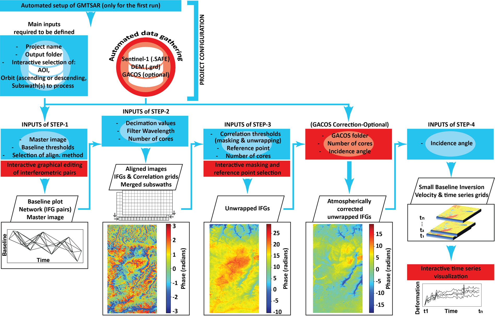

# Project Overview

InSARLite is a comprehensive Graphical User Interface (GUI) application designed to simplify and streamline Interferometric Synthetic Aperture Radar (InSAR) processing using the GMTSAR workflow. This page provides an overview of InSAR fundamentals, InSARLite's architecture, and the complete processing workflow.

## What is InSAR?

### Interferometric Synthetic Aperture Radar Basics

Interferometric Synthetic Aperture Radar (InSAR) is a remote sensing technique that uses radar satellites to measure ground deformation and create digital elevation models. By comparing the phase information between two or more radar images of the same area taken at different times, InSAR can detect surface changes as small as a few millimeters.

#### Key InSAR Concepts

**Interferogram**: The phase difference between two SAR images, revealing surface deformation patterns.

**Baseline**: The spatial and temporal separation between satellite acquisitions:
- **Temporal Baseline**: Time difference between acquisitions
- **Perpendicular Baseline**: Spatial separation perpendicular to the satellite track

**Coherence**: A measure of phase stability between two SAR images, indicating the quality of interferometric information.

**Phase Unwrapping**: The process of converting wrapped phase values (-π to π) into continuous displacement measurements.

### Applications of InSAR

InSAR is widely used for:

- **Earthquake Monitoring**: Measuring co-seismic and post-seismic deformation
- **Volcano Studies**: Monitoring volcanic uplift and subsidence
- **Urban Subsidence**: Tracking land subsidence in cities
- **Landslide Detection**: Identifying and monitoring slope instability
- **Glacier Monitoring**: Measuring ice sheet dynamics
- **Infrastructure Monitoring**: Tracking deformation of buildings and bridges

## InSARLite Architecture

### Design Philosophy

InSARLite is built on the principle of **accessibility without compromising capability**. We have developed and tested InSARLite in Linux environments (Ubuntu 20.04 and 22.04) and released it as an open-source package via GitHub and PyPI.

It primarily uses the Python `subprocess` module to orchestrate GMTSAR command-line programs and shell scripts for various processing steps, while replacing selected GMTSAR shell-script components with Python implementations to enhance efficiency and flexibility. For example, the application of Generic Atmospheric Correction Online Service (GACOS) corrections to unwrapped interferograms builds on the GMTSAR user-contributed shell script.

For enhanced performance, we implemented parallel processing using a Python thread pool for several steps that involve repeated execution of similar operations, including GACOS atmospheric correction, interferogram generation, and phase unwrapping. This allows independent jobs to be dispatched concurrently, reducing total processing time for large stacks while preserving the underlying GMTSAR workflow.

```{note}
**Platform Compatibility**: InSARLite has been developed and tested exclusively on **Ubuntu 20.04 and 22.04**. Other operating systems have not been tested and are not officially supported.
```

```{note}
**NASA Earthdata Credentials**: InSARLite requires NASA Earthdata credentials to authenticate access to Alaska Satellite Facility (ASF) datasets. These credentials are requested only once and stored locally for automated retrieval in subsequent executions.
```

### Conceptual Structure

The conceptual structure of InSARLite is organized around **four main processing steps** that follow project configuration:



*The conceptual architecture illustrates four sequential processing steps following project configuration. Project configuration enables users to define input dataset paths (or download/extract data automatically), specify temporal and spatial parameters, select subswath(s) and SAR polarization, and set orbit direction—establishing the foundation for streamlined InSAR time-series analysis. Red-highlighted operations represent newly implemented functionalities within the traditional GMTSAR workflow, while blue-highlighted modifications support automation and transition from command-line to interactive graphical interface.*

#### Project Configuration
The project configuration step enables users to:
- Define paths to input datasets or download/extract data automatically
- Specify temporal period and spatial extent
- Select subswath(s), SAR polarization, and orbit direction
- Set up DEM (Digital Elevation Model) requirements
- Configure output directories and project naming

This foundation supports streamlined and automated InSAR time-series processing.

#### Step 1: Baseline Network Selection (Base2Net)
- Calculate temporal and perpendicular baselines for all image pairs
- Visualize baseline-time relationships interactively
- Select optimal master (reference) image
- Define interferometric pairs based on baseline thresholds
- Export network configuration for processing

#### Step 2: Alignment and Interferogram Generation
- Align secondary images to master reference
- Generate interferograms for selected pairs
- Merge multiple subswaths (if applicable)
- Calculate mean correlation grids
- Apply filtering and quality assessment

#### Step 3: Phase Unwrapping
- Define processing mask (correlation threshold and/or manual delineation)
- Select reference point for phase normalization
- Unwrap interferogram phase
- Optionally apply atmospheric corrections (GACOS)
- Validate unwrapping quality

#### Step 4: SBAS Inversion and Time Series
- Perform Small Baseline Subset (SBAS) inversion
- Generate deformation time series
- Calculate mean velocity maps
- Apply optional spatio-temporal filtering
- Visualize and export results

```{note}
**Newly Implemented Features**: Operations highlighted in red in Figure 2 represent newly implemented functionalities within the traditional GMTSAR workflow, including automated data download, interactive baseline planning, parallel processing, and integrated visualization tools.
```

```{note}
**Automation Enhancements**: Operations highlighted in blue in Figure 2 represent modifications that support automation and the transition from command-line interface to user-friendly interactive interface, such as GUI-based parameter selection, progress monitoring, and one-click execution of complex workflows.
```

## Processing Workflow

InSARLite implements a sequential workflow where controls relevant to the current stage remain active, while other controls are inactive or hidden, guiding users through the InSAR time-series analysis process.

```{note}
**Button Color Coding**: Button controls are color-coded to indicate status:
- **Default appearance**: Missing execution or parameter definition
- **Green**: Ready for the corresponding action
- **Orange**: Action has been partially completed
- **Red**: Optional step has been intentionally skipped
```

### Complete Processing Pipeline

The InSARLite workflow consists of an initial **Project Configuration** step followed by **four main processing steps**:

#### Project Configuration (Step 0)

**Purpose**: Set up the project foundation before processing begins.

1. **Spatial and Temporal Definition**
   - Define study area extent (bounding box or AOI)
   - Specify date range for Sentinel-1 acquisitions
   - Select orbit direction (ascending/descending)

2. **Data Management**
   - Query available Sentinel-1 scenes from ASF
   - Download selected data automatically
   - Extract downloaded ZIP files
   - Validate extracted SAFE directories

3. **DEM Setup**
   - Specify path to existing DEM file, or
   - Automatically download SRTM DEM (30m or 90m resolution)

4. **Output Configuration**
   - Define output folder location
   - Set project name
   - Optionally configure GACOS atmospheric correction data

5. **Confirmation**
   - Review all configuration parameters
   - Click "Confirm Configuration" to finalize setup
   - Generate complete directory structure

Once configuration is confirmed, the four main processing steps become accessible.

#### Step 1: Baseline Network Selection (01_Base2Net)

**Purpose**: Design the interferometric network by selecting master image and defining image pairs.

1. **Baseline Calculation**
   - Compute temporal and perpendicular baselines for all images
   - Generate baseline_table.dat with centrality ranking
   - Display baseline plot with time vs perpendicular baseline

2. **Master Selection**
   - Review network centrality rankings
   - Select optimal master image (typically lowest average baseline)
   - Confirm master selection

3. **Network Design**
   - Define temporal baseline threshold (e.g., 48 days)
   - Define perpendicular baseline threshold (e.g., 250 meters)
   - Generate and visualize interferometric pairs
   - Optionally edit network (add/remove connections)

4. **Export**
   - Save baseline configuration
   - Export interferometric network for processing

**Key Outputs**: `baseline_table.dat`, `intf.in` (pair list), baseline plots

#### Step 2: Alignment and Interferogram Generation (02_Align_Generate)

**Purpose**: Align images and generate interferograms for all defined pairs.

1. **Parameter Definition**
   - Set range decimation factor
   - Set azimuth decimation factor
   - Define filter wavelength
   - Specify number of processing cores

2. **Processing Steps** (automated)
   - Align secondary images to master reference
   - Generate interferograms for all pairs
   - Merge subswaths (if multiple selected)
   - Calculate mean correlation grid
   - Calculate correlation standard deviation

3. **Progress Monitoring**
   - Real-time process status updates
   - Subswath-specific progress indicators
   - Terminal output for detailed logging

**Key Outputs**: Aligned images, interferograms, `corr_avg.grd`, `corr_std.grd`

#### Step 3: Phase Unwrapping (03_Unwrap)

**Purpose**: Unwrap interferogram phase and normalize to reference point.

**Phase 1: Mask Definition (Optional)**
1. Define processing mask using:
   - Mean correlation threshold (e.g., 0.08)
   - Manual polygon delineation, or
   - Combination of both approaches
2. Visualize and export mask

**Phase 2: First Unwrapping**
1. Set correlation threshold
2. Specify number of processing cores
3. Unwrap all interferograms (respecting mask if defined)

**Phase 3: Reference Point Selection**
1. Choose reference point method:
   - Automated (highest mean correlation, lowest std deviation)
   - Manual (interactive selection on map)
2. Select using mean correlation map or validity count map
3. Normalize all interferograms to reference point

**Phase 4: Optional Atmospheric Correction**
- Apply GACOS corrections (if configured)
- Re-normalize interferograms

**Key Outputs**: Unwrapped interferograms (`unwrap.grd`), phase files (`phase.grd`), mask file

#### Step 4: SBAS Inversion and Visualization (04_SBAS)

**Purpose**: Perform time-series inversion and visualize deformation results.

1. **SBAS Configuration**
   - Set incidence angle
   - Define smoothing factor
   - Select SBAS mode (standard or parallel)
   - Configure optional outputs (RMS, DEM residual)
   - Set atmospheric filtering iterations (if desired)

2. **SBAS Processing** (automated)
   - Perform Small Baseline Subset inversion
   - Generate displacement time series
   - Calculate mean velocity (VLOS)
   - Apply optional spatio-temporal filtering

3. **Visualization**
   - Launch Surface Deformation Visualizer
   - Reproject velocity from radar to geographic coordinates
   - Generate velocity KML for Google Earth
   - Display interactive velocity map

4. **Interactive Analysis**
   - Click any location to view time series
   - Use Polygon Mode for multi-pixel analysis
   - Export time series plots (PNG format)
   - Export time series data (CSV format)

**Key Outputs**: `disp_*.grd` (time series), `vel.grd` (mean velocity), KML files, time series plots

### Data Flow Summary

```
Sentinel-1 SLC Data → Orbit Files → Alignment → Interferograms → 
Unwrapping → SBAS Inversion → Deformation Time Series → Visualization
            ↑                    ↑                ↑
          DEM Data          Mask & Ref Pt    GACOS Data
```

For detailed step-by-step instructions with screenshots, see the [Turkey Case Study Tutorial](../tutorials/turkey-case-study.md).

## Key Features

### 🎯 **Interactive Baseline Planning**
- Real-time baseline network visualization
- Click-and-drag pair selection
- Automatic master scene selection
- Network optimization tools

### 🛰️ **Automated Data Management**
- Seamless EarthData integration
- Bulk data downloads with progress tracking
- Automatic file organization
- DEM data acquisition and processing

### ⚙️ **Professional Processing**
- Complete GMTSAR workflow integration
- Parallel processing capabilities
- Quality control at each step
- Flexible parameter configuration

### 📊 **Advanced Visualization**
- Interactive result viewing
- Time series plotting and analysis
- Publication-ready figure generation
- Animation creation tools

### 🔧 **User-Friendly Interface**
- Intuitive step-by-step workflow
- Progress tracking and logging
- Error handling and recovery
- Comprehensive help system

## Technical Specifications

### Supported Data Types
- **SAR Data**: Sentinel-1 (C-band)
- **DEM Data**: SRTM (30m and 90m resolution)
- **Orbits**: Precise and restituted orbits
- **Atmospheric**: GACOS atmospheric corrections

```{note}
**Future DEM Support**: ASTER and NASADEM DEM options are planned for future releases.
```

### Output Formats
- **Raster**: NetCDF, GeoTIFF, GMT GRD
- **Vector**: Shapefiles, KML
- **Images**: PNG, PDF, SVG
- **Data**: CSV, HDF5

### Performance Characteristics
- **Processing Speed**: Optimized for multi-core systems
- **Memory Usage**: Efficient memory management
- **Scalability**: Handles large datasets and long time series
- **Reliability**: Robust error handling and recovery

## Best Practices

### Project Planning
1. **Start Small**: Begin with limited areas and time periods
2. **Check Data Availability**: Verify Sentinel-1 coverage
3. **Consider Baselines**: Plan for optimal temporal/spatial baselines
4. **Resource Planning**: Ensure adequate storage and computation

### Data Quality
1. **Coherence Assessment**: Monitor interferometric quality
2. **Baseline Optimization**: Use appropriate baseline thresholds
3. **Seasonal Considerations**: Account for vegetation and weather
4. **Validation**: Cross-check results with independent data

### Processing Efficiency
1. **Parallel Processing**: Utilize multiple CPU cores
2. **Storage Management**: Use fast storage for processing
3. **Memory Optimization**: Monitor memory usage
4. **Incremental Processing**: Process in manageable chunks

## Next Steps

Ready to start using InSARLite? Continue to:

- [User Interface Guide](interface.md) - Learn the InSARLite interface
- [Data Management](data-management.md) - Set up data downloads
- [Quick Start Guide](../quickstart.md) - Complete your first project

For technical details, see:
- [Developer Guide](../developer-guide/index.md) - Architecture and internals